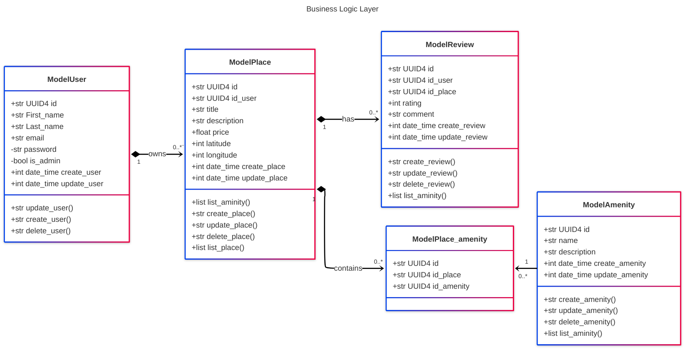

# HBnB UML

This project contains all diagram for HBnB project

## High-Level Package Diagram

...

## Detailed Class Diagram for Business Logic Layer

In this diagram we have 5 class : `User`, `Place`, `Review`, `Place_amenity` and `Amenity`.

The `User` class can create a `Place`.

`Place` can have `Review` and `Amenity`.

`Place` can't exist `Userless`, `Review` can't exist `Placeless` and `Amenity` can't exist `Placeless` too.

