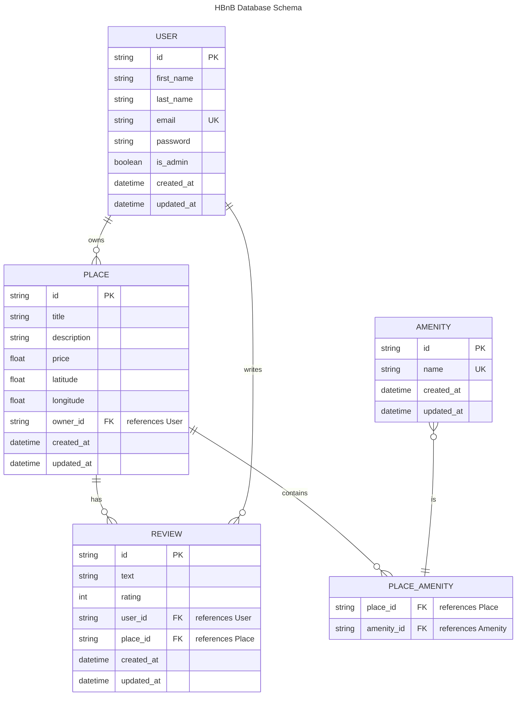

# HBnB - Part 3: Authentication & Database Integration

Ce projet est une API RESTful avancée pour la gestion d'annonces de logements (type AirBnB), développée dans le cadre de Holberton School.  
La **Part 3** introduit l'authentification JWT et l'intégration d'une base de données SQLite avec SQLAlchemy ORM pour une persistance durable des données.

---

## Nouveautés de la Part 3

🔐 **Authentification & Autorisation :**
- Système d'authentification JWT (JSON Web Tokens)
- Protection des endpoints sensibles
- Gestion des rôles utilisateur (admin/user)
- Login/logout sécurisé

🗄️ **Base de données & Persistance :**
- Migration de la persistance in-memory vers SQLite
- Intégration SQLAlchemy ORM
- Relations de base de données (Foreign Keys, Many-to-Many)
- Persistance durable des données

## Objectif

Créer une API complète et sécurisée pour gérer :
- Les **utilisateurs** (User) avec authentification
- Les **logements** (Place) avec propriétaires
- Les **commodités** (Amenity) liées aux logements
- Les **avis** (Review) avec contrôle d'accès

Avec :
- **Authentification JWT** pour sécuriser l'API
- **Base de données SQLite** avec SQLAlchemy
- **Validation stricte** des données et permissions
- **Documentation Swagger** automatique
- **Tests automatisés** complets
- **Architecture scalable** et sécurisée

---

## La structure du projet
```
hbnb/
├── app/
│   ├── __init__.py
│   ├── api/
│   │   ├── __init__.py
│   │   ├── v1/
│   │       ├── __init__.py
│   │       ├── users.py
│   │       ├── places.py
│   │       ├── reviews.py
│   │       ├── amenities.py
│   │       ├── auth.py
│   ├── models/
│   │   ├── __init__.py
│   │   ├── user.py
│   │   ├── place.py
│   │   ├── review.py
│   │   ├── amenity.py
│   ├── services/
│   │   ├── __init__.py
│   │   ├── facade.py
│   ├── persistence/
│       ├── __init__.py
│       ├── repository.py
├── run.py
├── config.py
├── requirements.txt
├── README.md
```

---

## Database Schema (SQLite + SQLAlchemy)



---

## Installation et Configuration

### 1. Cloner le projet
```bash
git clone https://github.com/yourusername/holbertonschool-hbnb.git
cd holbertonschool-hbnb/part3/hbnb
```

### 2. Installer les dépendances
```bash
pip install -r requirements.txt
```

### 3. Configuration de la base de données
```bash
# Initialiser la base de données SQLite
python3 -c "from app import create_app; app = create_app(); app.app_context().push(); from app.models import db; db.create_all()"
```

### 4. Variables d'environnement (optionnel)
```bash
export FLASK_ENV=development
export JWT_SECRET_KEY=your-secret-key-here
export DATABASE_URL=sqlite:///hbnb_dev.db
```

---

## Fonctionnalités principales

### 🔐 Authentification
- **JWT Authentication** : Login sécurisé avec tokens
- **Protection des routes** : Endpoints protégés par authentification
- **Gestion des rôles** : Permissions admin/user
- **Sécurité renforcée** : Validation des tokens et expiration

### 🗄️ Base de données
- **SQLite** : Base de données légère et portable
- **SQLAlchemy ORM** : Mapping objet-relationnel
- **Relations** : Foreign keys et associations many-to-many
- **Persistance** : Données sauvegardées durablement

### 🛠️ API Features
- **CRUD complet** sur User, Place, Amenity, Review
- **Validation métier** : email, coordonnées, prix, unicité, etc.
- **Gestion des relations** : propriétaires, commodités, avis
- **Endpoints RESTful** clairs et versionnés (`/api/v1/`)
- **Documentation Swagger** générée automatiquement
- **Tests automatisés** (pytest/unittest)
- **Architecture scalable** et maintenable

---

## Endpoints d'authentification (Part 3)

| Méthode | Endpoint                   | Description                  | Auth Required |
|---------|----------------------------|------------------------------|---------------|
| POST    | `/api/v1/auth/register`    | Créer un compte utilisateur  | ❌             |
| POST    | `/api/v1/auth/login`       | Se connecter (obtenir JWT)   | ❌             |
| POST    | `/api/v1/auth/logout`      | Se déconnecter               | ✅             |
| GET     | `/api/v1/auth/profile`     | Profil utilisateur connecté  | ✅             |

## Exemples d'endpoints avec authentification

| Méthode | Endpoint                                 | Description                        | Auth Required |
|---------|------------------------------------------|------------------------------------|---------------|
| POST    | `/api/v1/users/`                         | Créer un utilisateur               | ❌             |
| GET     | `/api/v1/users/`                         | Lister tous les utilisateurs       | ✅ (Admin)     |
| GET     | `/api/v1/users/<user_id>`                | Détail d'un utilisateur            | ✅             |
| PUT     | `/api/v1/users/<user_id>`                | Modifier un utilisateur            | ✅ (Owner)     |
| POST    | `/api/v1/places/`                        | Créer un logement                  | ✅             |
| GET     | `/api/v1/places/`                        | Lister tous les logements          | ❌             |
| GET     | `/api/v1/places/<place_id>`              | Détail d'un logement               | ❌             |
| PUT     | `/api/v1/places/<place_id>`              | Modifier un logement               | ✅ (Owner)     |
| POST    | `/api/v1/amenities/`                     | Créer une commodité                | ✅ (Admin)     |
| GET     | `/api/v1/amenities/`                     | Lister toutes les commodités       | ❌             |
| GET     | `/api/v1/amenities/<amenity_id>`         | Détail d'une commodité             | ❌             |
| PUT     | `/api/v1/amenities/<amenity_id>`         | Modifier une commodité             | ✅ (Admin)     |
| POST    | `/api/v1/reviews/`                       | Créer un avis                      | ✅             |
| GET     | `/api/v1/reviews/`                       | Lister tous les avis               | ❌             |
| GET     | `/api/v1/reviews/<review_id>`            | Détail d'un avis                   | ❌             |
| PUT     | `/api/v1/reviews/<review_id>`            | Modifier un avis                   | ✅ (Owner)     |
| DELETE  | `/api/v1/reviews/<review_id>`            | Supprimer un avis                  | ✅ (Owner)     |

---

## Validation métier & Sécurité

### Authentification
- **JWT Tokens** : Expiration configurable, secret sécurisé
- **Permissions** : Contrôle d'accès basé sur les rôles
- **Protection** : Endpoints sensibles protégés

### Validation des données
- **User** : email valide et unique, prénom/nom non vides, mot de passe sécurisé
- **Place** : titre non vide, prix positif, latitude/longitude dans les bornes, propriétaire valide
- **Review** : texte non vide, rating entre 1 et 5, user/place existants, un avis par user/place
- **Amenity** : nom unique et non vide, max 50 caractères

---

## Exemples tests avec authentification

### Authentification

```python
def test_login_valid_user(client):
    """Test login with valid credentials."""
    # First create a user
    client.post('/api/v1/auth/register', json={
        "first_name": "Alice",
        "last_name": "Smith", 
        "email": "alice@example.com",
        "password": "secure123"
    })
    
    # Then login
    response = client.post('/api/v1/auth/login', json={
        "email": "alice@example.com",
        "password": "secure123"
    })
    assert response.status_code == 200
    assert "access_token" in response.json

def test_protected_endpoint_without_auth(client):
    """Test accessing protected endpoint without token."""
    response = client.post('/api/v1/places/', json={"title": "Nice Place"})
    assert response.status_code == 401
```

### Base de données et persistance

```python
def test_user_persistence(client):
    """Test that user data persists in database."""
    # Create user
    response = client.post('/api/v1/auth/register', json={
        "first_name": "Bob",
        "last_name": "Wilson",
        "email": "bob@example.com", 
        "password": "secure123"
    })
    user_id = response.json["id"]
    
    # Restart app simulation - data should persist
    response = client.get(f'/api/v1/users/{user_id}')
    assert response.status_code == 200
    assert response.json["email"] == "bob@example.com"
```

### Tests classiques

```python
def test_api_create_amenity_valid(client):
    response = client.post('/api/v1/amenities/', json={"name": "Wi-Fi"})
    assert response.status_code == 201
    assert response.json["name"] == "Wi-Fi"

def test_create_user(self):
    """Test creating a user with valid data."""
    response = self.client.post('/api/v1/users/', json={
        "first_name": "Alice",
        "last_name": "Smith",
        "email": "alice.smith@example.com"
    })
    self.assertEqual(response.status_code, 201)
    self.assertEqual(response.json["first_name"], "Alice")
    self.assertIn("id_user", response.json)
```

---

## Lancer les tests
```bash
pytest app/tests/
```

---

## Lancer l'application

### Mode développement
```bash 
python3 run.py 
```

### Avec variables d'environnement
```bash
export FLASK_ENV=development
export JWT_SECRET_KEY=your-super-secret-key
python3 run.py
```

### Tester l'API
```bash
# Register a new user
curl -X POST http://127.0.0.1:5000/api/v1/auth/register \
  -H "Content-Type: application/json" \
  -d '{"first_name": "John", "last_name": "Doe", "email": "john@example.com", "password": "secure123"}'

# Login to get JWT token
curl -X POST http://127.0.0.1:5000/api/v1/auth/login \
  -H "Content-Type: application/json" \
  -d '{"email": "john@example.com", "password": "secure123"}'

# Use token to access protected endpoint
curl -X GET http://127.0.0.1:5000/api/v1/auth/profile \
  -H "Authorization: Bearer YOUR_JWT_TOKEN_HERE"
```

---

## Technologies utilisées

- **Framework** : Flask + Flask-RESTx
- **Base de données** : SQLite + SQLAlchemy ORM  
- **Authentification** : JWT (JSON Web Tokens)
- **Tests** : pytest + unittest
- **Documentation** : Swagger/OpenAPI automatique
- **Python** : 3.8+

---

## API Documentation

L'API est disponible à l'adresse : `http://127.0.0.1:5000`

**Documentation Swagger** : `http://127.0.0.1:5000/api/v1/doc`

### Structure des réponses
- **Succès** : Code 200/201 + données JSON
- **Erreur de validation** : Code 400 + message d'erreur
- **Non autorisé** : Code 401 + message d'erreur  
- **Non trouvé** : Code 404 + message d'erreur
- **Erreur serveur** : Code 500 + message d'erreur

---

## Évolutions Part 3

✅ **Authentification JWT implémentée**  
✅ **Base de données SQLite + SQLAlchemy**  
✅ **Persistance des données**  
✅ **Protection des endpoints**  
✅ **Gestion des rôles et permissions**  
✅ **Tests complets avec auth et DB**

---

# Authors

**HBnB Part 3 - Authentication & Database Integration**

Wassef Abdallah  
Julien Girardey  
Lucas Boyadjian  

*Holberton School - 2025*
